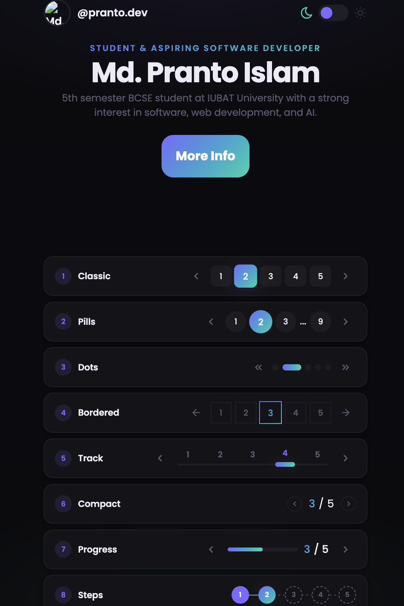

# Page Change Design

A clean landing page demo with multiple pagination styles: Classic, Pills, Bordered, Dots, Track, Compact, and Progress.



## Use

1. Open `index.html` in your browser to preview the demo.
2. Copy the pagination block you want from the `index.html` file.
3. Use the corresponding CSS block from `style.css` listed below.
4. If you want to reuse only a single pagination style, copy the relevant `<nav class="pag pag--...">` block and the matching CSS lines.

## Pagination Variants

| Variant | CSS line start | CSS line end | Notes |
|---|---|---|---|
| Classic | 277 | 283 | Standard numbered buttons with active gradient style |
| Pills | 290 | 372 | Rounded pill buttons with ellipsis and responsive active styling |
| Dots | 366 | 372 | Minimal dot controls with active dot highlight |
| Bordered | 374 | 383 | Outline button style with gradient active state |
| Track | 390 | 405 | Horizontal track with thumb movement and active step highlight |
| Compact | 408 | 417 | Small, compact arrow + counter pagination style |
| Progress | 422 | 433 | Progress bar style with step fill and counter |

## Copy / Paste Example

### Classic HTML snippet

```html
<div class="specimen">
  <div class="specimen__label"><span class="specimen__num">1</span><span class="specimen__name">Classic</span></div>
  <nav class="pag pag--classic" aria-label="Classic pagination">
    <input type="radio" name="a" id="a1" class="pag-r" aria-label="Page 1">
    <input type="radio" name="a" id="a2" class="pag-r" checked aria-label="Page 2">
    <input type="radio" name="a" id="a3" class="pag-r" aria-label="Page 3">
    <input type="radio" name="a" id="a4" class="pag-r" aria-label="Page 4">
    <input type="radio" name="a" id="a5" class="pag-r" aria-label="Page 5">
    <div class="pag__nav-zone pag__nav-zone--prev" aria-hidden="true">...</div>
    <label for="a1" class="pag__item">1</label>
    <label for="a2" class="pag__item">2</label>
    <label for="a3" class="pag__item">3</label>
    <label for="a4" class="pag__item">4</label>
    <label for="a5" class="pag__item">5</label>
    <div class="pag__nav-zone pag__nav-zone--next" aria-hidden="true">...</div>
  </nav>
</div>
```

### Quick CSS reference

- For `Classic`, use the CSS block around `style.css` lines `277–283`.
- For `Pills`, use the block around `290–372`.
- For `Bordered`, use the block around `374–383`.
- For `Dots`, use the block around `366–372`.
- For `Track`, use the block around `390–405`.
- For `Compact`, use the block around `408–417`.
- For `Progress`, use the block around `422–433`.

## Notes

- `Demo.png` is included in this repository and is referenced above in the README.
- The page is built with pure HTML and CSS, no JavaScript needed for the pagination demo.
- If you want to use only one pagination style, keep the associated `.pag` markup and its CSS section.
